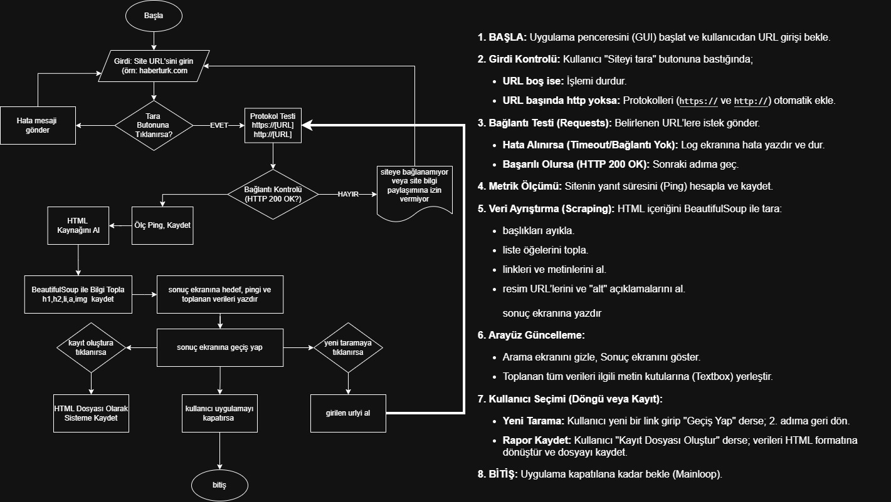

# Web-Scraper-Tool 🕷️

CustomTkinter ve BeautifulSoup kullanılarak geliştirilmiş; web sayfalarındaki temel HTML bileşenlerini hızlıca ayrıştırıp HTML formatında raporlayabilen, modern arayüzlü bir masaüstü veri kazıma (web scraping) aracı.

*(Buraya uygulamanın bir ekran görüntüsünü ekleyebilirsin)*

## 🚀 Özellikler
* **Hızlı Tarama:** Hedef sitenin H1/H2 başlıklarını, liste öğelerini, linklerini ve görsellerini saniyeler içinde çeker.
* **Ağ Metrikleri:** Bağlantı testi yaparak sitenin gerçek Ping (yanıt) süresini ölçer.
* **HTML Raporlama:** Taranan verileri şık bir HTML dosyası olarak bilgisayarınıza kaydetmenizi sağlar.
* **Modern Arayüz:** CustomTkinter ile tasarlanmış, karanlık tema destekli yormayan tasarım.

## 🧠 Çalışma Mantığı
`

## 📦 Son Kullanıcı İçin Kullanım (Kurulumsuz)
Eğer Python ile uğraşmak istemiyorsanız, doğrudan derlenmiş programı kullanabilirsiniz:
1. `dist` klasörüne girin.
2. `web scraper.exe` dosyasını indirin ve çalıştırın.
